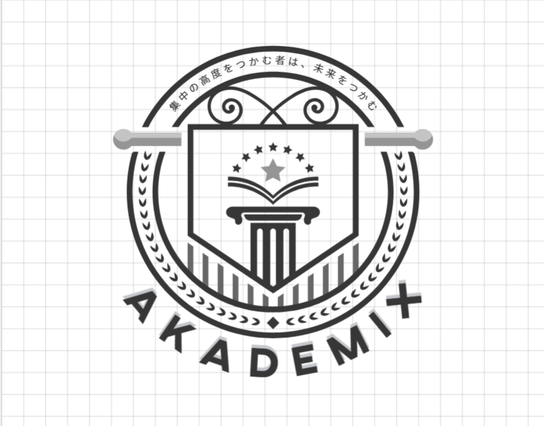

# 🎓 AKADEMIX Logo Guidelines

## 🎨 Design Tools & Specifications
Created using Adobe Creative Suite:
- ✏️ Adobe Illustrator 2024
- Initial sketching and vector creation
- Final logo refinement and export
- 🖼️ Adobe Photoshop 2024
- Image optimization
- Asset preparation for different platforms
- 🎯 Adobe XD
- UI/UX implementation guidelines
- Responsive scaling tests

### 🛠️ Technical Specifications
- Document Size: 1000px x 1000px
- Artboard: 800px x 800px
- Grid System: 8x8
- Vector Format: AI, SVG
- Resolution: 300 DPI for print materials

## 🎨 Logo Overview
The AKADEMIX logo represents our commitment to educational excellence through a thoughtfully designed emblem that combines classical and modern elements.

### ⚜️ Core Elements
- 🛡️ Shield Design: A protective shield shape symbolizing trust and academic strength
- 📚 Book & Stars: An open book crowned with stars representing knowledge and excellence
- 🏛️ Classical Pillar: Represents strong educational foundation and timeless wisdom
- ⭕ Circular Frame: Encompassing laurel elements symbolizing achievement
- 🌟 Japanese Inscription: "学中の商店をつかむ者は、未来をつかむ" (Those who grasp learning grasp the future)

## 📏 Logo Specifications

### 🎯 Primary Logo Components
- Shield with vertical stripes (Pen Tool + Pathfinder)
- Centered classical column (Custom shape + Stroke)
- Decorative scroll work at top (Pen Tool + Width Tool)
- Laurel wreath border (Pattern Brush)
- "AKADEMIX" typography in bold capitals (Custom tracked lettering)

### 🎨 Color Palette
- Primary: Black (#000000)
- Secondary: White (#FFFFFF)
- Background: Transparent
- Grid Lines: Light Gray (#E5E5E5)

### ✍️ Typography
- Logo Text: Sans-serif, custom tracked
- Japanese Text: Traditional Japanese font
- Character Spacing: 50 units
- Leading: Auto

## 📐 Usage Guidelines

### ✅ Do's
- Maintain minimum clear space around logo
- Use approved color variations
- Keep proportions when scaling
- Preserve aspect ratio
- Use high-resolution versions for print

### ❌ Don'ts
- Don't modify the logo elements
- Don't change the typography
- Don't rotate the logo
- Don't add effects or shadows
- Don't alter the proportions

## 📦 File Formats & Organization
Adobe Source Files:
```
/source/
├── AKADEMIX_Logo_Master.ai
├── AKADEMIX_Logo_Components.ai
└── AKADEMIX_Logo_Guidelines.pdf
```

Export Formats:
```
/exports/
├── vector/
│   ├── AKADEMIX_Logo.ai
│   ├── AKADEMIX_Logo.eps
│   └── AKADEMIX_Logo.svg
├── web/
│   ├── AKADEMIX_Logo.png
│   └── AKADEMIX_Logo.jpg
└── print/
    └── AKADEMIX_Logo_CMYK.pdf
```

## 📏 Minimum Size
- Digital: 32px height minimum
- Print: 0.5 inches height minimum

## 🎨 Logo Variations
1. Primary (Full Color)
2. Black & White
3. Reversed (White)
4. Monochrome

## 💡 Special Applications
- Favicon: Simplified shield version
- Social Media: Square-optimized version
- App Icon: Simplified emblem version

## 📞 Contact
For logo usage inquiries:
- 📧 brand@akademix.edu
- 🌐 akademix.edu/brand

## 🔄 Version Control
- Version: 1.0.0
- Last Updated: February 2025
- Created with Adobe Creative Suite 2024

---
© 2025 AKADEMIX - All Rights Reserved
